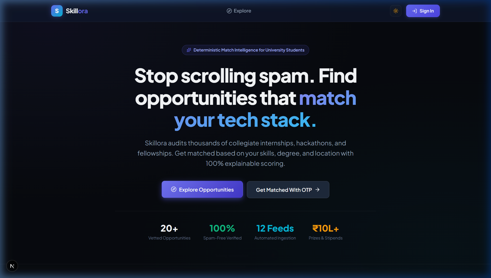
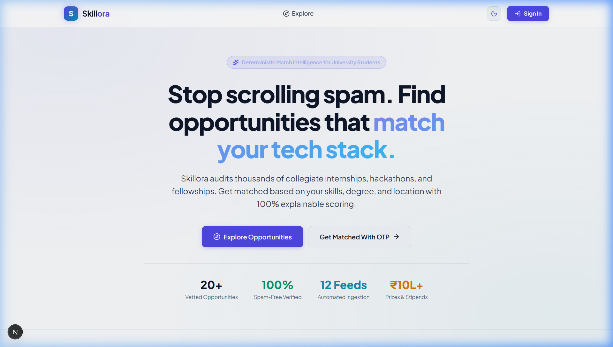
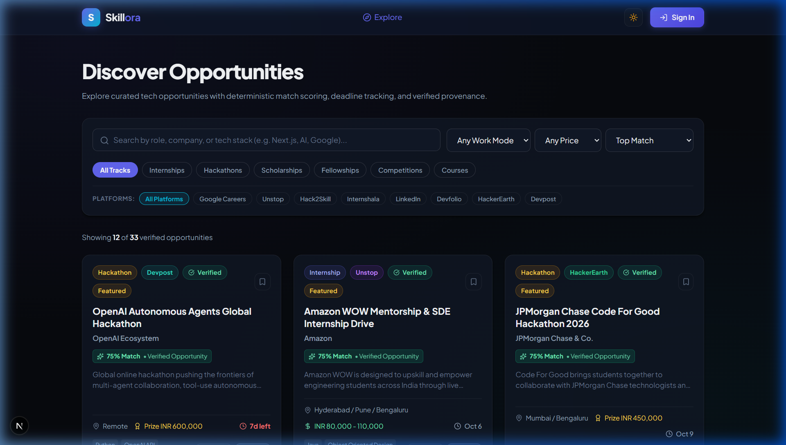
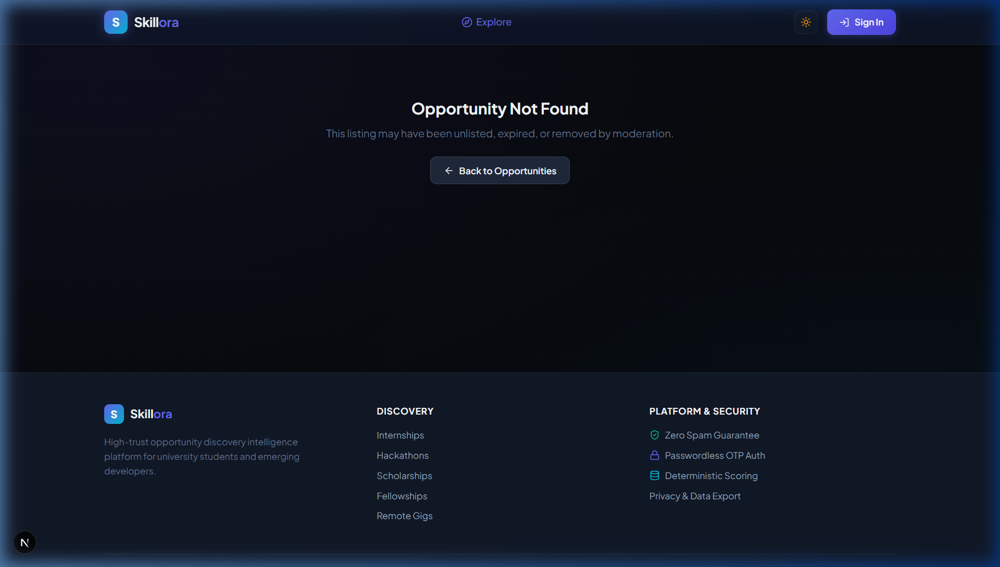
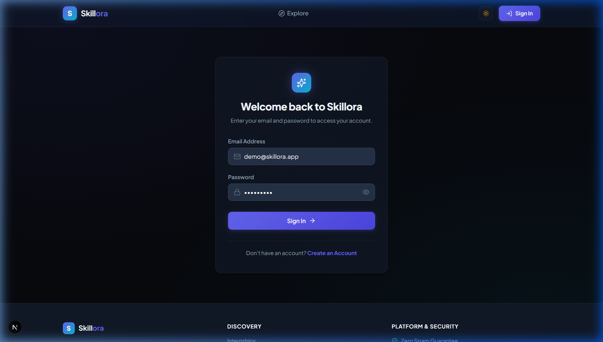
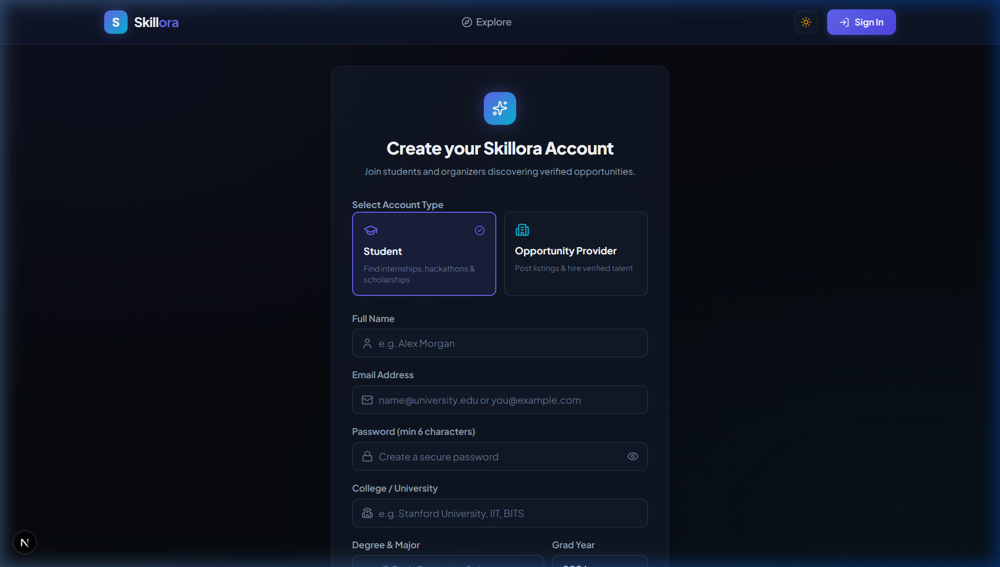
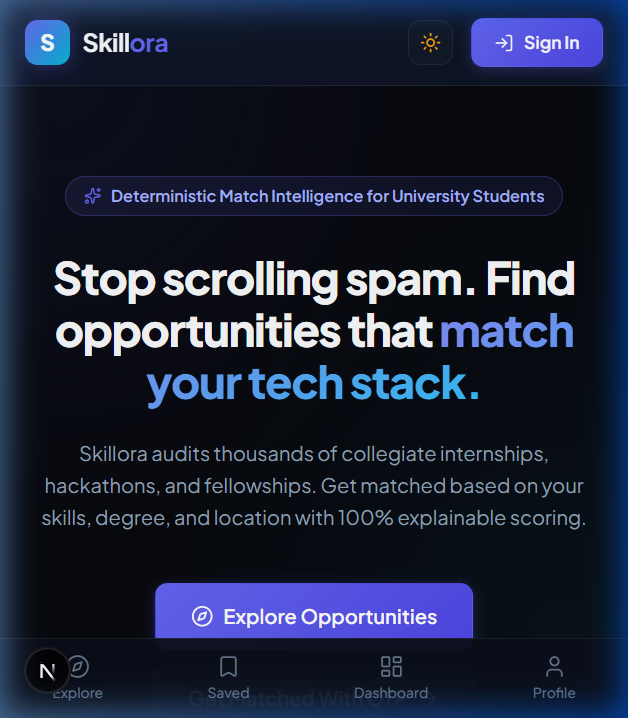

<div align="center">

  

  <p><strong>High-Trust Student Opportunity Intelligence & Deterministic Matching Platform</strong></p>

  <p>
    <a href="https://skillora-aditya.vercel.app"></a>
    <a href="docs/video/skillora_showcase_1min.mp4"></a>
    <a href="https://nextjs.org"></a>
    <a href="https://react.dev"></a>
    <a href="https://www.typescriptlang.org"></a>
    <a href="https://supabase.com"></a>
    <a href="#test-suite"></a>
    <a href="#license"></a>
  </p>

  <p>
    <a href="https://skillora-aditya.vercel.app"><strong>🌐 Visit Live App</strong></a> •
    <a href="#-1-minute-video-walkthrough--voiceover-demo"><strong>🎬 Watch Video Demo</strong></a> •
    <a href="#-key-features">Features</a> •
    <a href="#-ui-showcase">Screenshots</a> •
    <a href="#-system-architecture">Architecture</a> •
    <a href="#-project-structure">Project Structure</a> •
    <a href="#-api-reference">REST APIs</a> •
    <a href="#-getting-started">Getting Started</a> •
    <a href="#-test-suite">Tests</a>
  </p>

</div>

---

> 💡 **Want to see how Skillora works in action?**  
> Check out the **1-minute interactive video walkthrough below** or jump directly to the live production deployment at [**https://skillora-aditya.vercel.app**](https://skillora-aditya.vercel.app).

---

## 🎬 1-Minute Video Walkthrough & Voiceover Demo

> 📺 **Download / Play High-Definition Video**: [**`docs/video/skillora_showcase_1min.mp4`**](docs/video/skillora_showcase_1min.mp4) *(1080p HD, 60 FPS, ~67 sec)*  
> 🌐 **Official Live Platform**: [**https://skillora-aditya.vercel.app**](https://skillora-aditya.vercel.app)  
> 📝 **Closed Captions**: [SRT Subtitles](docs/video/skillora_subtitles.srt) • [VTT Subtitles](docs/video/skillora_subtitles.vtt)

<div align="center">
  <a href="docs/video/skillora_showcase_1min.mp4">
    
  </a>
  <p><em>Click the image to play the video demo or visit the <a href="https://skillora-aditya.vercel.app"><strong>live website</strong></a>.</em></p>
</div>

### ⏱️ Video Timeline, Voiceover & Closed Captions (CC)

| Timestamp | Scene | Voiceover Narration | Closed Captions (CC) |
| :--- | :--- | :--- | :--- |
| **0:00 - 0:10** | **Hero & Vision** | *"Welcome to Skillora, the high-trust student opportunity intelligence platform built on Next.js 16, React 19, and Supabase."* | `[Skillora: High-Trust Student Opportunity Intelligence]` |
| **0:10 - 0:19** | **Verified Ingestion** | *"It automatically ingests and deduplicates internships, hackathons, and fellowships from Google, Devpost, and Unstop."* | `[Verified Sources & SHA-256 Deduplication]` |
| **0:19 - 0:31** | **Deterministic Scoring** | *"Unlike black-box recommenders, Skillora provides a 100% explainable score based on skill match, category, location, and deadline urgency."* | `[Deterministic: 35% Skills + 20% Track + 15% Location + 30% Urgency]` |
| **0:31 - 0:40** | **Glassmorphism UI** | *"The interface features rich glassmorphism styling, vibrant gradients, and instant dark and light mode transitions."* | `[Glassmorphism & Instant Dark/Light Mode]` |
| **0:40 - 0:48** | **Mobile Responsive** | *"It is fully responsive for mobile devices, enabling students to track opportunities on the go with zero friction."* | `[Mobile-First Responsive Interface]` |
| **0:48 - 0:58** | **Security & Privacy** | *"Security is enterprise-grade with PostgreSQL Row Level Security, secure auth cookies, and GDPR self-service account deletion."* | `[PostgreSQL RLS + GDPR Right-to-Erasure]` |
| **0:58 - 1:07** | **Live Production** | *"Skillora is live on Vercel with 100% passing tests. Explore the demo at skillora-aditya.vercel.app!"* | `[Live Demo: skillora-aditya.vercel.app]` |

---

## 🌟 Overview

**Skillora** is an open-source, high-trust student opportunity intelligence platform. It eliminates spam and fragmented browsing by aggregating, deduplicating, verifying, and deterministically ranking tech internships, hackathons, scholarships, fellowships, and developer grants for university students and engineers.

Unlike opaque AI recommenders, Skillora features a **100% explainable, deterministic relevance scoring engine** that matches candidates based on verified skills, academic background, location mode, and application deadlines.

---

## 📸 UI Showcase

<div align="center">

### 🌓 Desktop Experience (Dark & Light Glassmorphism)

| Dark Mode (Default) | Light Mode |
| :---: | :---: |
|  |  |

### 🔍 Discovery & Detailed Provenance

| Vetted Opportunities Catalog | Deep Opportunity View & Audit |
| :---: | :---: |
|  |  |

### 🔐 Streamlined Authentication & Mobile Responsive

| Frictionless Sign In | Clean Account Creation | Mobile Layout |
| :---: | :---: | :---: |
|  |  |  |

</div>

---

## 🚀 Key Features

### 1. 🛡️ High-Trust Opportunity Pipeline
- **Verified Sources**: Automated crawlers & ingestion pipeline across verified platforms (*Google Careers, Unstop, Devpost, HackerEarth, Devfolio*).
- **Intelligent Deduplication**: Multi-layer deduplication combining exact URL canonicalization, SHA-256 payload hashing, and fuzzy Levenshtein distance matching ($similarity \ge 0.85$).
- **Provenance & Fraud Audits**: Every listing carries full source metadata, application link verification, and community reporting workflows.

### 2. 🎯 Deterministic Match Scoring Engine
- **No Hallucinations**: 100% transparent and explainable mathematical scoring algorithm ($0–100\%$).
- **Scoring Breakdown**:
  - **35% Direct Skill Match**: Exact & fuzzy intersection of candidate skills (*Python, TypeScript, PyTorch, React, Docker*) with role requirements.
  - **20% Category Alignment**: Explicit track prioritization (Internships, Hackathons, Fellowships, Scholarships).
  - **15% Location & Work Mode Fit**: Remote-friendly boost and geographical campus proximity matching.
  - **30% Urgency & Source Trust**: Exponential urgency decay boost for deadlines closing within 7 days + verified platform multiplier.

### 3. ⚡ Modern, Friction-Free Authentication
- Direct **Email & Password** authentication with Supabase Auth.
- Clean session establishment via Next.js SSR middleware cookies.
- Role-based separation: **Students** and **Opportunity Providers**.
- Instant 1-click Sign Out and permanent GDPR/DPDP-compliant **Self-Service Account Deletion**.

### 4. 📊 Student Dashboard & Application Tracker
- **Kanban Pipeline**: Track opportunities through `Saved` ➔ `Applied` ➔ `Interviewing` ➔ `Offered` ➔ `Archived`.
- **Deadline Alerts**: Customizable reminder system for cutoff deadlines.
- **Skills Matrix**: Dynamic skill tag management for real-time match recalibration.

### 5. 🔒 Enterprise Security & GDPR / DPDP Compliance
- **Row Level Security (RLS)**: PostgreSQL-enforced multi-tenant isolation.
- **Data Portability**: 1-click export of complete student data package in standard JSON.
- **Right to Erasure**: Stored procedure `delete_user_account(user_uuid)` wipes profile, saved items, reminders, consents, and auth credentials cleanly.

---

## 🏗️ System Architecture

```mermaid
flowchart TB
    subgraph Ingestion["Crawler & Ingestion Engine"]
        A1[RSS / Webhooks / Scrapers] --> A2[URL Canonicalizer]
        A2 --> A3[SHA-256 Hash Deduplicator]
        A3 --> A4[Levenshtein Fuzzy Matcher]
        A4 --> A5[(Raw Ingested Records)]
    end

    subgraph Database["Supabase PostgreSQL (Database + RLS)"]
        A5 --> DB1[(opportunities)]
        DB1 --> DB2[(saved_opportunities)]
        DB1 --> DB3[(opportunity_reminders)]
        DB4[(profiles)] --> DB2
        DB5[(audit_logs)]
    end

    subgraph Backend["Next.js 16 App Router (Server & APIs)"]
        API1[/api/opportunities]
        API2[/api/recommendations - Relevance Scorer]
        API3[/api/auth - Login / Signup / Session]
        API4[/api/user - Profile / Export / Delete]
        API5[/api/admin - Moderation & Sources]
    end

    subgraph Frontend["Next.js 16 SSR + Glassmorphic UI"]
        UI1[Home & Match Intelligence]
        UI2[Discovery & Filter Catalog]
        UI3[Opportunity Detail & Audit]
        UI4[Student Dashboard & Tracker]
        UI5[Profile & Settings / GDPR]
    end

    DB1 <--> Backend
    DB4 <--> Backend
    Backend <--> Frontend
```

---

## 📂 Project Structure

```
skillora/
├── app/                               # Next.js App Router
│   ├── (admin)/                       # Admin Moderation & Feed Ingestion Portal
│   │   ├── admin/moderation/          # Community Reports & Fraud Queue
│   │   ├── admin/sources/             # Ingestion Sources & Crawler Health
│   │   └── admin/page.tsx             # Admin Overview
│   ├── (auth)/                        # Authentication Pages
│   │   ├── login/page.tsx             # Email / Password Sign In
│   │   └── register/page.tsx          # Account Registration (Student / Provider)
│   ├── (dashboard)/                   # Authenticated User Space
│   │   ├── dashboard/page.tsx         # Personalized Match Feed & Analytics
│   │   ├── profile/page.tsx           # Skills Matrix & Academic Profile
│   │   ├── reminders/page.tsx         # Deadline Reminders & Alerts
│   │   ├── saved/page.tsx             # Application Tracker (Saved/Applied/Interviewing)
│   │   └── settings/page.tsx          # Privacy, Data Export & Account Deletion
│   ├── (discovery)/                   # Opportunities Catalog
│   │   ├── opportunities/page.tsx     # Public Search, Filter & Catalog
│   │   └── opportunities/[id]/        # Deep Opportunity View & Audit
│   ├── api/                           # REST API Route Handlers
│   │   ├── admin/                     # Moderation & Ingestion Source APIs
│   │   ├── auth/                      # Login, Signup, Logout, Session Handlers
│   │   ├── health/                    # Server Health Check Endpoint
│   │   ├── ingestion/                 # Automated Scraper Ingestion Webhook
│   │   ├── opportunities/             # Opportunities CRUD, Save, Report, Remind
│   │   ├── recommendations/           # Deterministic Recommendation Scoring API
│   │   └── user/                      # Profile, Consents, JSON Export, Deletion
│   ├── globals.css                    # Glassmorphism Design Tokens (Light/Dark)
│   ├── layout.tsx                     # Root Layout (Nav, Footer, Theme)
│   └── page.tsx                       # High-Impact Homepage
├── components/                        # UI Components
│   ├── Footer.tsx                     # Footer with Branding & Navigation
│   ├── Navbar.tsx                     # Sticky Glassmorphic Header
│   ├── OpportunityCard.tsx            # Opportunity Card with Badges & Provenance
│   ├── SaveButton.tsx                 # Real-time Bookmark Toggle
│   └── SearchFilterBar.tsx            # Track, Mode, and Keyword Filters
├── database/                          # Production SQL Migrations & Schemas
│   ├── schema.sql                     # PostgreSQL DDL Tables & Indexes
│   ├── rls_policies.sql               # Row Level Security Policies
│   ├── functions_triggers.sql         # Account Deletion Stored Procedures & Triggers
│   ├── seeds.sql                      # Demo Opportunities & Sources
│   └── README.md                      # Database Schema & Entity Relationships
├── docs/                              # Technical Documentation & Assets
│   ├── screenshots/                   # High-Res UI Screenshots
│   ├── video/                         # 1-Minute Walkthrough Video & CC Subtitles
│   │   ├── skillora_showcase_1min.mp4 # Full 1080p Video Walkthrough
│   │   ├── skillora_subtitles.srt     # SRT Subtitles
│   │   └── skillora_subtitles.vtt     # VTT Subtitles
│   ├── ARCHITECTURE.md                # System Architecture & Relevance Formulas
│   ├── BACKEND_API.md                 # Full REST API Reference
│   └── FRONTEND.md                    # Design System & Component Guidelines
├── lib/                               # Core Utilities & Algorithms
│   ├── supabase/                      # SSR, Client, Server, & Middleware Clients
│   ├── database.types.ts              # TypeScript Database Schema Types
│   ├── ingestion.ts                   # Normalizer, Hash & Levenshtein Deduplication
│   ├── relevance.ts                   # Explainable Deterministic Relevance Scorer
│   ├── utils.ts                       # Formatters & UI Utilities
│   └── validations/                   # Zod Validation Schemas
├── public/                            # Static Branding & Icon Assets
├── tests/                             # Node.js Native Test Suite (18 tests)
│   ├── ingestion.test.mjs             # Ingestion & Deduplication Tests
│   ├── relevance.test.mjs             # Match Scoring Engine Tests
│   ├── rls.test.mjs                   # Supabase RLS Policy Security Tests
│   ├── utils.test.mjs                 # Formatter & Utility Tests
│   └── validations.test.mjs           # Zod Schema Validation Tests
├── .env.example                       # Environment Configuration Template
├── next.config.ts                     # Next.js 16 Config
├── package.json                       # Dependencies & Scripts
├── tsconfig.json                      # Strict TypeScript Configuration
└── README.md                          # Repository Documentation
```

---

## 🛠️ Tech Stack

| Domain | Technologies |
| :--- | :--- |
| **Frontend Framework** | [Next.js 16](https://nextjs.org/) (App Router, Turbopack, Server Actions) |
| **UI Library** | [React 19](https://react.dev/) |
| **Language** | [TypeScript 5](https://www.typescriptlang.org/) (Strict Mode) |
| **Database & Auth** | [Supabase](https://supabase.com/) (PostgreSQL 15+, Row Level Security, Auth SSR) |
| **Styling** | Vanilla CSS Design System with Glassmorphic Tokens & HSL Dark/Light Mode |
| **Icons** | [Lucide React](https://lucide.dev/) |
| **Validation** | [Zod](https://zod.dev/) |
| **Testing** | Node.js Native Test Runner (`node:test`, `node:assert`) |

---

## 🔌 API Reference

| Endpoint | Method | Description | Auth Required |
| :--- | :--- | :--- | :---: |
| `/api/auth/signup` | `POST` | Register student or provider account | No |
| `/api/auth/login` | `POST` | Sign in with email and password | No |
| `/api/auth/logout` | `POST` | Clear session cookies and sign out | Yes |
| `/api/auth/session` | `GET` | Get current authenticated user session | Yes |
| `/api/opportunities` | `GET` | Filter and paginate verified opportunities | No |
| `/api/opportunities/[id]` | `GET` | Get opportunity details & provenance | No |
| `/api/opportunities/[id]/save` | `POST` | Bookmark / save opportunity | Yes |
| `/api/opportunities/[id]/remind` | `POST` | Set deadline reminder | Yes |
| `/api/opportunities/[id]/report` | `POST` | Submit spam / fraud report | Yes |
| `/api/recommendations` | `GET` | Deterministic scored match feed | Yes |
| `/api/user/profile` | `GET/PUT` | Read and update academic/skills profile | Yes |
| `/api/user/export` | `GET` | GDPR Data Portability (Download all data JSON) | Yes |
| `/api/user/delete` | `POST` | Permanent GDPR account & data deletion | Yes |
| `/api/admin/moderation` | `GET/POST` | Opportunity moderation & review queue | Admin |
| `/api/admin/sources` | `GET/POST` | Manage crawler sources & ingestion feeds | Admin |
| `/api/health` | `GET` | System health check endpoint | No |

---

## 🚀 Getting Started

### 1. Prerequisites
- **Node.js** >= 18.18.0 or 20.x
- **npm** or **pnpm**
- A **Supabase** account (Free tier supported)

### 2. Clone Repository
```bash
git clone https://github.com/adityaaadubey/skillora.git
cd skillora
```

### 3. Configure Environment Variables
Copy `.env.example` to `.env.local`:
```bash
cp .env.example .env.local
```

Fill in your Supabase credentials:
```env
NEXT_PUBLIC_SUPABASE_URL=https://your-project.supabase.co
NEXT_PUBLIC_SUPABASE_ANON_KEY=your-supabase-anon-key
NEXT_PUBLIC_APP_URL=http://localhost:3000
NEXT_PUBLIC_APP_NAME=Skillora
CRON_SECRET=your_secure_cron_secret
```

### 4. Database Setup
Run the SQL scripts in your Supabase SQL Editor in the following order:
1. `database/schema.sql` (Tables, ENUMs, Indexes)
2. `database/rls_policies.sql` (Row Level Security policies)
3. `database/functions_triggers.sql` (Stored procedures & triggers)
4. `database/seeds.sql` (Initial demo opportunities & sources)

### 5. Install & Run Locally
```bash
# Install dependencies
npm install

# Start development server
npm run dev
```
Open [http://localhost:3000](http://localhost:3000) in your browser.

---

## 🧪 Test Suite

Skillora includes comprehensive automated unit, integration, and security tests:

```bash
# Run all automated tests (Ingestion, Scoring, RLS, Validations, Utils)
npm test
```

```
✔ Ingestion Engine - Canonical URL Normalization
✔ Ingestion Engine - Slug Generation
✔ Ingestion Engine - Exact Payload Hash Deduplication
✔ Ingestion Engine - Fuzzy Levenshtein Duplicate Detection
✔ Relevance Engine - Baseline Unauthenticated Visitors
✔ Relevance Engine - Direct Skill Match & Remote Scoring
✔ Relevance Engine - Expired Deadline Penalty
✔ RLS Audit - Anonymous Read on Public Opportunities
✔ RLS Audit - Anonymous Cannot Read Ingested Raw Items
✔ RLS Audit - Anonymous Cannot Insert into Saved Opportunities
✔ Validations - Login Schema
✔ Validations - Signup Schema
✔ Validations - Opportunity Filters
✔ Validations - Save Opportunity
✔ Validations - Profile Update
✔ Canonical Utils - Category Badge Classes
✔ Canonical Utils - Deadline Formatting & Urgency
✔ Canonical Utils - Compensation Formatting

ℹ tests 18 | pass 18 | fail 0 (100% Pass Rate)
```

---

## 🔒 Security & Privacy

- **Row Level Security**: Direct database queries are shielded by strict RLS rules preventing unauthorized access or privilege escalation.
- **CSRF & Security Headers**: Next.js security headers with strict content policies.
- **Zero Third-party Tracker Policy**: No telemetry or third-party cookies.
- **GDPR / DPDP Compliance**: Complete self-service user data export and unrecoverable account erasure.

---

## 📄 License

This project is licensed under the **MIT License** - see the [LICENSE](LICENSE) file for details.

---

<div align="center">
  <sub>Built with ❤️ for university engineers and ambitious builders worldwide.</sub>
</div>
